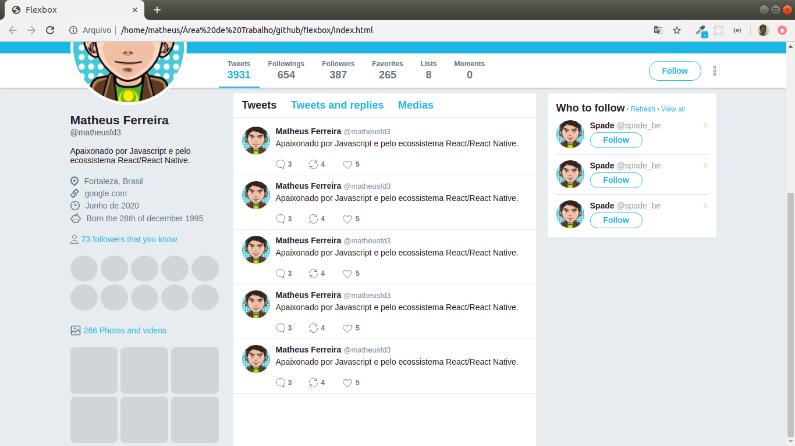

<h1 align="center">
  Flexbox
</h1>

<h3 align="center">
  CSS Flexible Box Layout.
</h3>

<h5 align="center">
  <a href="https://matheusfd3.github.io/flexbox/">https://matheusfd3.github.io/flexbox/</a>
</h5>

